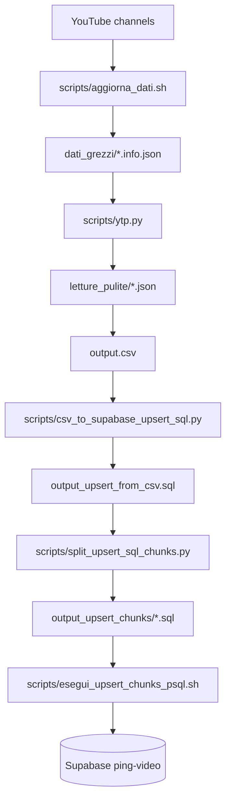

# PingTV Project

Repository per raccolta, normalizzazione e pubblicazione dati video (YouTube ping pong) con frontend di ricerca e pipeline automatizzata.

## Quick Start

1. Configura le variabili in `.env` (puoi partire da `.env.example`).
1. Esegui la pipeline completa:

```bash
bash scripts/aggiorna_dati.sh
```

1. Avvia la SPA in locale:

```bash
python3 scripts/serve_spa.py --port 5501
```

## Panoramica

Il progetto ha due aree principali:

1. **Data pipeline**: scarica metadati YouTube, traduce/normalizza, genera SQL, applica UPSERT su Supabase.
2. **Frontend SPA**: interfaccia HTML/CSS/JS per filtrare e cercare i video pubblicati.

## Struttura repository

- `scripts/`
  - Tutti gli script `.sh` e `.py`.
  - Vedi documentazione dettagliata in `scripts/README.md`.

- `dati_grezzi/`
  - JSON originali prodotti da `yt-dlp`.

- `letture_pulite/`
  - JSON trasformati e arricchiti.

- `backup/`
  - Backup timestampati delle cartelle dati.

- `logs/`
  - Log esecuzioni pipeline.

- `output.csv`
  - Dataset finale tabellare usato per generazione SQL.

- `output_upsert_from_csv.sql`
  - SQL UPSERT completo.

- `output_upsert_chunks/`
  - SQL diviso in chunk (`output_upsert_from_csv_part_*.sql`).

- `index.html`, `styles.css`, `script.js`
  - Frontend della web app.

- `config.local.js`
  - Config locale frontend (non mettere segreti qui).

- `.env`, `.env.example`
  - Config runtime per script.

- `.github/workflows/aggiorna-dati.yml`
  - Pipeline GitHub Actions.

## Flusso dati end-to-end



## Esecuzione locale

Pipeline completa:

```bash
bash scripts/aggiorna_dati.sh
```

Saltando download (da step 4):

```bash
bash scripts/aggiorna_dati.sh --skip-download
```

Server locale SPA:

```bash
python3 scripts/serve_spa.py --port 5501
```

## CI/CD con GitHub Actions

Workflow: `.github/workflows/aggiorna-dati.yml`

Trigger supportati:

- `workflow_dispatch` (manuale)
- `schedule` (cron)

Artifact caricati a fine run:

- Log (`logs/`)
- Output SQL (`output_upsert_from_csv.sql` + `output_upsert_chunks/`)

## Secrets GitHub richiesti

- `SUPABASE_DB_URL` (obbligatorio)
- `SUPABASE_URL` (consigliato)
- `SUPABASE_SERVICE_ROLE_KEY` (consigliato)

Note:

- I secrets non devono essere committati.
- Usa sempre branch protetti e accessi limitati al repository.

## Dipendenze

Sistema:

- `bash`
- `python3`
- `yt-dlp`
- `psql`

Python package:

- `langdetect`
- `deep-translator`

## File utili

- `appunti.txt`
  - note operative/manuali.

- `atleti_italiani.txt`
- `atleti_italiani_invertiti.txt`
  - liste di supporto per riconoscimento atleti in `ytp.py`.
